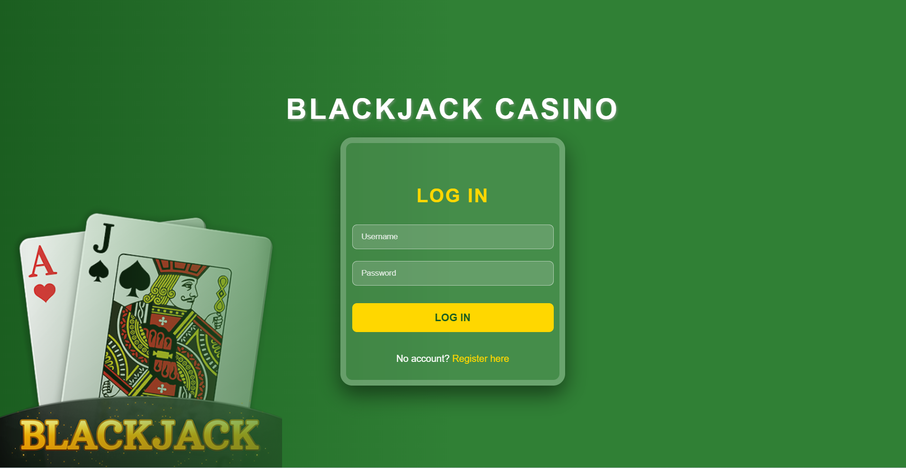
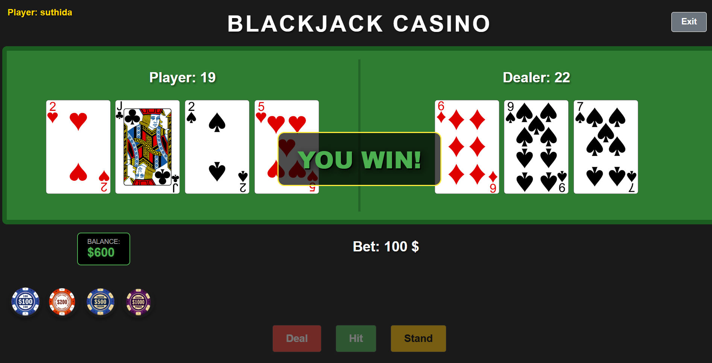

# Blackjack Casino
### Detta projekt är en webbaserad lösning för spelet Blackjack, skapat som en del av kursen i webbutveckling. Syftet med projektet är att visa hur man kopplar ihop logik (JS) med design (CSS) och hur man sparar data i webbläsaren.

### I spelet möter användaren en dator (dealer). Målet är att få summan 21, eller så nära som möjligt, utan att hamna över 21 (bli "tjock").

## Tekniska funktioner
### 1. Inloggning och säkerhet
För att kunna spela måste användaren först logga in.

Registrering: Om det är en ny spelare sparas användarnamn och lösenord i en lista.

LocalStorage: All användardata sparas som JSON-objekt. Detta gör att kontot finns kvar även om man stänger ner webbläsaren.

### 2. Hantering av pengar 
Startkapital (Default): Varje ny användare börjar automatiskt med 1000$ i sin kassa.

Satsningslogik: Innan en runda startar får spelaren välja en insats. JavaScript kontrollerar att spelaren har tillräckligt med pengar för att genomföra satsningen.

Vinst och Förlust: Vid vinst uppdateras saldot i LocalStorage med den vunna summan. Vid förlust dras pengarna direkt från användarens konto i LocalStorage.

Påfyllning: Om spelarens kassa blir tom finns en funktion för att fylla på pengar, vilket krävs för att kunna fortsätta spela.
### 3. Spelmekanik och Bilder
Spelet använder de bifogade bildfilerna för att visa korten.

Dynamiska bilder: När man klickar på "Hit" (nytt kort) skapar JavaScript ett nytt -element på skärmen.

Dealer AI: Datorn har en enkel logik där den drar kort tills den når minst 17 poäng.

Resultat: Spelet visar tydligt vem som vann och ger användaren valet att "Spela igen".

## Design och Gränssnitt
Designen är skapad för att ge en äkta casinokänsla:
Tema: Mörkgrönt spelbord med guldiga detaljer för att skapa lyxig känsla.
Användarvänlighet: Knappar och text är stora och tydliga så att det är lätt att förstå spelets gång.

### Inloggningssidan

### Spelplanen
(Här kan du lägga till en skärmdump på när du spelar)

